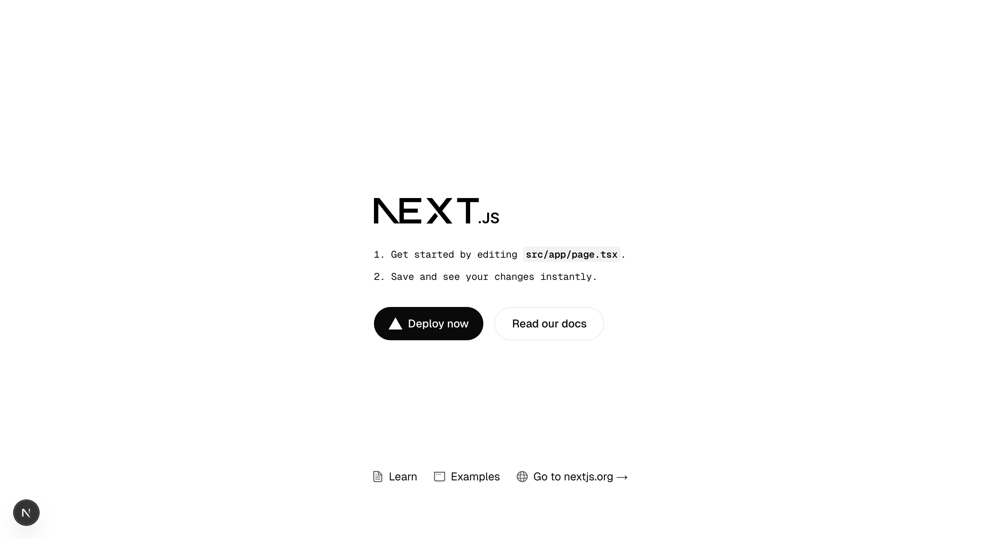

# Membangun Chatbot AI Dengan Next.js 15, Gemini, dan Shadcn

Kamis, 24 April 2025.

Dokumentasi proyek online technical workshop Hacktiv8.

Catatan: Dokumentasi di bawah ini tidak membahas kesuluruhan topik Workshop dan hanya membahas tentang implementasi Chatbot AI menggunakan Next.js 15, Gemini, dan Shadcn secara umum.

## Deskripsi

Di proyek ini, kita akan membuat chatbot AI berbasis web menggunakan Next.js 15, Google Gemini, dan Shadcn UI. Tujuannya? Agar kamu bisa memiliki chatbot modern yang tampilannya menarik dan juga cerdas berkat Gemini. Proyek ini dibangun sebagai bagian dari online technical workshop Hacktiv8, sehingga cocok untuk kamu yang ingin belajar integrasi AI ke dalam aplikasi web modern.

Mulai dari setup awal, install package, hingga coding, semuanya akan kita bahas langkah demi langkah. Let's go!

## Persiapan dan Instalasi

Sebelum memulai implementasi, berikut beberapa hal yang perlu di persiapkan/install terlebih dahulu. Bila kamu sudah meng-install hal-hal di bawah ini, silahkan untuk lanjut ke tahap berikutnya.

### Node.js dan npm

Node.js adalah platform runtime open-source yang memungkinkan developer untuk menjalankan kode JavaScript di luar browser. npm (Node Package Manager) adalah manajer paket resmi untuk Node.js. Dengan npm, developer dapat menginstal, mengelola, dan membagikan paket atau modul JavaScript yang digunakan dalam proyek.

[Download di sini](https://nodejs.org/en)

### Visual Studio Code

Visual Studio Code (VS Code) adalah sebuah code editor gratis dan open-source yang dikembangkan oleh Microsoft. VS Code secara native mendukung React dan Next.js, menawarkan fitur seperti IntelliSense, navigasi kode, dan debugging yang memudahkan pengembangan.

[Download di sini](https://code.visualstudio.com/)

## Implementasi Chatbot AI menggunakan Next.js 15, Gemini, dan Shadcn

Di tahap ini kita akan membuat proyek Next.js 15 yang sudah terintegrasi dengan Gemini dan Shadcn. Silahkan buka aplikasi Visual Studio yang sudah kamu install, kemudian buka terminalnya dengan cara memilih 'New Termianl' pada tab menu 'Terminal' yang ada pada Visual Studio Code.


Selanjutnya ikuti instruksi di bawah ini.

### Instalasi dan Konfigurasi Proyek Next.js 15

1. Pertama, install proyek Next.js 15 melalui terminal dengan menjalankan perintah ini:
```
npx create-next-app@latest <nama-proyek>
```
> Catatan: Silahkan isi <nama-proyek> dengan nama yang kamu inginkan.

2. Pada konfigurasi proyek ("Would you like to use ...?"), pilih 'Yes' kecuali pada import alias


3. Bila proyek sudah selesai di install, kamu bisa menjalankan proyek dengan cara ini:
    * Masuk ke dalam proyek melalui terminal dengan menjalankan perintah ini:
    ```
    cd <nama-proyek>
    ```
    * Bila sudah, jalankan proyek dengan perintah ini:
    ```
    npm run dev
    ```
    * Setelah itu pada terminal akan muncul alamat localhost proyek yang sudah kamu jalankan seperti gambar di bawah ini.
    
    * Silahkan salin salah satu alamat yang tampil kemudian buka di browser mu, maka hasilnya akan seperti ini.
    

4. Kalau kamu sudah memastikan bahwa proyek berjalan dengan baik, kamu bisa menghentikannya terlebih dahulu dengan menekan tombol keyboard: **`control + c`** atau **`ctrl + c`** pada terminal Visual Studio Code.

### Menambahkan Package/Library yang Diperlukan

5. Selanjutnya kita akan menambahkan beberapa package yang dibutuhkan untuk pembangunan proyek. Pada terminal Visual Studio Code silahkan jalankan perintah ini.
```
npm install ai @ai-sdk/react @ai-sdk/google
```

6. Setelah itu kita perlu juga untuk menambahkan shadcn-chatbot-kit dengan menjalankan perintah ini:
```
npx shadcn@latest add https://shadcn-chatbot-kit.vercel.app/r/chat.json
```
> Selain untuk menambahkan shadcn-chatbot-kit ke dalam proyek, perintah di atas juga secara otomatis akan menginstall library Shadcn UI ke dalam proyek kita.

7. Pada “You need to create a components.json file to add components. Proceed? » (Y/n)” tekan **`Enter`** di Keyboard.

8. Lalu pilih base color yang kamu inginkan.


9. Kemudian bila muncul pemberitahuan seperti pada gambar di bawah, pilih **`Use –-force`**.


10. Selanjutnya kita perlu menambahkan komponen Card dari Shadcn. Pada terminal jalankan perintah ini.
```
npx shadcn@latest add card
```

### Menambahkan Kode
Sekarang kita sudah menambahkan semua hal yang diperlukan, selanjutnya adalah main dish nya. Let's code!

11. Untuk membuat Chatbot AI, pastinya kita perlu menyiapkan sebuah tempat untuk menampung percakapan kita dengan Gemini. Maka dari itu pertama kita akan membuat sebuah komponen baru yang bernama **`chat-container.tsx`**. Buatlah komponen tersebut di dalam folder **`src/components`**.

12. Setelah itu pada chat-container.tsx silahkan tambahkan kode ini.
```
"use client";

import { useChat } from "@ai-sdk/react";
import { cn } from "@/lib/utils";
import { Chat } from "@/components/ui/chat";
import { type Message } from "@/components/ui/chat-message";

export function ChatWithSuggestions() {
  const {
    messages: uiMessages,
    input,
    handleInputChange,
    handleSubmit,
    append,
    isLoading,
    stop,
  } = useChat();

  const messages = uiMessages as unknown as Message[];

  return (
    <div
      className={cn(
        "flex flex-col w-full min-h-[400px] max-h-[600px] h-[70vh] overflow-hidden"
      )}
    >
      <Chat
        className="flex-1 overflow-y-auto"
        messages={messages}
        input={input}
        handleInputChange={handleInputChange}
        handleSubmit={handleSubmit}
        isGenerating={isLoading}
        stop={stop}
        append={append}
        suggestions={[
          "Generate a tasty vegan lasagna recipe for 3 people.",
          "Generate a list of 5 questions for a frontend job interview.",
          "Who won the 2022 FIFA World Cup?",
        ]}
      />
    </div>
  );
}
```
> Kode ini merupakan referensi dari dokumentasi shadcn-chatbot-kit, kamu bisa melihatnya di [sini](https://shadcn-chatbot-kit.vercel.app/docs/components/chat)

> JANGAN LUPA UNTUK DI SAVE

13. Selanjutnya buka file **`page.tsx`** yang berada di folder **`src/app`** dan ubah seluruh isi kodenya dengan kode ini.
```
import { ChatWithSuggestions } from "@/components/chat-container";
import { Card, CardContent } from "@/components/ui/card";

export default function Home() {
  return (
    <main className="flex flex-col items-center justify-center p-12 max-w-1xl mx-auto">
      <Card className="w-full max-w-2xl">
        <CardContent>
          <ChatWithSuggestions />
        </CardContent>
      </Card>
    </main>
  );
}
```
> JANGAN LUPA UNTUK DI SAVE

14. Sampai sini kita sudah selesai menghandle tampilannya, selanjutnya adalah untuk menyiapkan sisi servernya. Silahkan buat folder **`api`** pada folder **`src/app`**.

15. Lalu buat juga folder **`chat`** di dalam folder **`api`** yang baru dibuat tadi.

16. Setelah itu di dalam folder **`chat`** tadi buat sebuah file baru bernama **`route.ts`**, kemudian tambahkan kode ini di dalamnya.
```
import { createGoogleGenerativeAI } from '@ai-sdk/google';
import { streamText } from 'ai';
import { NextResponse } from 'next/server';

export async function POST(req: Request) {
  const { messages } = await req.json();

  if (!messages) {
    return NextResponse.json(
      { error: 'Messages are required.' },
      { status: 400 }
    );
  }

  try {
    const google = createGoogleGenerativeAI({
      apiKey: process.env.GEMINI_AI_API_KEY
    });

    const result = await streamText({
      model: google('models/gemini-1.5-flash'),
      system: "You are a helpful assistant.",
      messages,
    });

    return result.toDataStreamResponse();
  } catch (error) {
    console.error('Error generating content:', error);
    return NextResponse.json(
      { error: 'Failed to generate content' }, 
      { status: 500 }
    );
  }
}
```
> JANGAN LUPA UNTUK DI SAVE

Sampai sini sebenarnya kita sudah selesai membuat keseluruhan proyek, namun ada satu hal paling krusial yang belum kita lakukan. Yaitu menambahkan API Key Gemini ke dalam proyek.

> API key adalah sebuah kode unik yang berfungsi untuk memberikan akses login dan menghubungkan kode dari developer satu ke developer lainnya.

17. Pada root proyek, atau pada lokasi tempat file yang bernama **`package.json`** berada silahkan buat sebuah file baru bernama **`.env.local`** dan ketik **`GEMINI_AI_API_KEY=`** di dalamnya.
> JANGAN LUPA UNTUK DI SAVE

18. Selanjutnya kita perlu mendapatkan API Key Gemini, untuk mendapatkannya silahkan kunjungi halaman Google AI Studio di [sini](https://aistudio.google.com/app/apikey)

19. Pada halaman tersebut, silahkan klik tombol **`Create API Key`** untuk mendapatkan API Key nya.

20. Copy API Key tersebut kemudian paste ke dalam file **`.env.local`** tadi seperti ini.
```
GEMINI_AI_API_KEY=paste-api-key-kamu-di-sini
```
> JANGAN LUPA UNTUK DI SAVE

21. Setelah itu silahkan jalankan proyek dengan perintah ini di dalam terminal Visual Studio Code.
```
npm run dev
```

22. Buka halaman proyek yang sudah berjalan berdasarkan alamat proyek yang kamu dapatkan dari terminal (seperti di awal tadi), lalu haslinya akan seperti ini.


## Penutup

Selamat, dengan ini kamu sudah berhasil membuat chatbot AI sederhana dengan menggunakan Next.js 15, Gemini, dan Shadcn. Semoga proyek ini dapat menambah insight dan wawasanmu. Jangan ragu untuk eksplorasi lebih jauh atau kembangkan fitur-fitur chatbot-nya sesuai kebutuhanmu. Happy coding dan selamat bereksperimen!

## Author

Dokumentasi ini dibuat oleh Dhiaulhaq Muhammad Naufal.

Punya pertanyaan? Jangan sungkan untuk hubungi saya!
* X: [@DhiaulhaqDev](https://x.com/dhiaulhaqdev)
* Email: [dmnaufal791@gmail.com](mailto:dmnaufal791@gmail.com)
* Website: [dhiaulhaq.github.io](https:dhiaulhaq.github.io)
* Linkedin: [Dhiaulhaq Muhammad Naufal](https://www.linkedin.com/in/dhiaulhaq-muhammad-naufal-031409158)

## Sumber Referensi

Dokumentasi ini dibuat berdasarkan sumber referensi di bawah ini.
* [nextjs.org](https://nextjs.org/docs/app/getting-started/installation)
* [ui.shadcn.com](https://ui.shadcn.com/docs/installation/next)
* [shadcn-chatbot-kit.vercel.app](https://shadcn-chatbot-kit.vercel.app/docs/components/chat)
* [sdk.vercel.ai](https://sdk.vercel.ai/providers/ai-sdk-providers/google-generative-ai)
* [OrcDev](https://youtu.be/mwAC1ZujtOc?si=DMu7TOJkX0jo9W_U)
